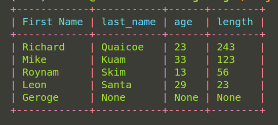

# PyTQL

<center>

</center>

<center>
<i>PyTQL package, easy to learn, fast to code, rich table formatting</i>
</center>

---
<br>

PyTQL is a simple python **``table data type``** with some query operations.
If you are working with python and you need a way to visaulize and interact with 
your data then PyTQL is the package for you.


## Authors

- [@AT_Khay (Richard Quaicoe)](https://github.com/Attakay78/)


## Installation

Install pytql with pip3

```bash
  pip3 install pytql==[version]
  current version = 0.0.3
```
    
## Usage/Examples

```python
from pytql.model import Model
from pytql.fields import CharField, IntField
from pytql.colors import Color
from pytql.table import Table
from pytql.repl import start_client, ReplType


class Student(Model):
    first_name = CharField(name="First Name", max_length=20)
    last_name = CharField()
    age = IntField()
    length = IntField()

# Data to populate Student table.
student_data = [
    ["Richard", "Quaicoe", 23, 243],
    ["Mike", "Kuam", 33, 123],
    ["Roynam", "Skim", 13, 56],
    ["Leon", "Santa", 29, 23],
    ["Geroge"],
]

# Example with passing data with `Student` Model.
student_table = Table(
    model=Student,
    data=student_data,
    header_color=Color.cyan,
    row_color=Color.green,
    table_color=Color.red,
)

student_table.draw_table()
```

<center>
Sample output of table generated.<br><br>

</center>


## Documentation

Check [docs](https://attakay78.github.io/Pytql/) for more information about the project and api references.