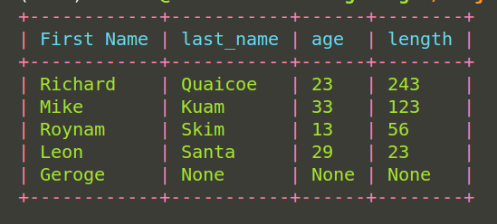

# Colors

This part of the documentation covers all possible colors supported for table beautification.

!!! tip ""
    <i style="font-size:18px;"> <span style="color:blue-grey"> class </span> <span style="color:teal">pytql.colors.Color</span>
    </i>

<br>

Supported colors:

* black
* blue
* cyan
* green
* orange
* pink
* purple
* red
* yellow
* dark_grey
* light_blue
* light_cyan
* light_green
* light_grey
* light_red


## Example

```python hl_lines="3 27-30"
from pytql.model import Model
from pytql.fields import CharField, IntField
from pytql.colors import Color
from pytql.table import Table
from pytql.repl import start_client, ReplType


class Student(Model):
    first_name = CharField(name="First Name", max_length=20)
    last_name = CharField()
    age = IntField()
    length = IntField()

# Data to populate Student table.
student_data = [
    ["Richard", "Quaicoe", 23, 243],
    ["Mike", "Kuam", 33, 123],
    ["Roynam", "Skim", 13, 56],
    ["Leon", "Santa", 29, 23],
    ["Geroge"],
]

# Example with passing data with `Student` Model.
student_table = Table(
    model=Student,
    data=student_data,
    header_color=Color.cyan,
    row_color=Color.green,
    table_color=Color.red,
)
```

<center>
The colors provided should generate the below table image<br><br>

</center>
