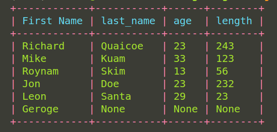
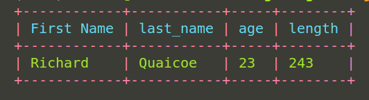
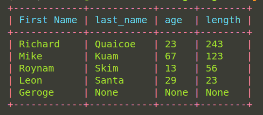

# Getting Started

<center>

</center>

<center>
*PyTQL package, easy to learn, fast to code, rich table formatting*
</center>

---
<br>

PyTQL is a simple python **``table data type``** with some query operations.
If you are working with python and you need a way to visaulize and interact with 
your data then Pytql is the package for you.

### The key features are

* **`Data type support`** - Has a **`model based`** structure for defining tables and **`Fields`** 
for table columns that define the field's types.
* **`Rich Format`** - Has a rich formatting feature to design and beautify the table the way you want.
* **`Easy`** - Designed to be easy to use and learn with less time reading docs.
* **`Client Interpreter`** - Has an option to use the feature of PyTQL on a cli interpreter 
(Supports other python commands).
* **`Import files`** - Has support to import your data files to work with. Files type supported; csv and json.
* **`Export data`** - Has support to export your table data into csv, json and html files.

## Installation

Install PyTQL with pip3

```bash
  pip install pytql==[version]
  current version = 0.0.3
```
    
## Usage/Examples
### Working with Python iterable data types (List, Tuple, Dict)

* Import the necessary packages from pytql

```python hl_lines="1-5"
from pytql.model import Model
from pytql.fields import CharField, IntField
from pytql.colors import Color
from pytql.table import Table
from pytql.repl import start_client, ReplType


class Student(Model):
    first_name = CharField(name="First Name", max_length=20)
    last_name = CharField()
    age = IntField()
    length = IntField()
```

??? tip

    * Table class is the class for creating the table instance. 
    * [Model](model.md)  class is the base class for creating your Table Model.
    * `CharField` and `IntField` classes are the table fields to be used.
    * `start_client` function is the function to start the cli interpreter.
    * `ReplType` class is the enum class containing all the cli interpreter types.

<br>

* Create the table Model<br><br>
*The `Student` class is out Table Model to be used which is inherited from the base `Model` class.*<br>
*The `CharField` is a character field with some specified field values used to specify the type
of the field*<br>
***NB:** By default the field name is infered from the Field instance name like `firstname`, but you can 
override the field name by passing a value to the `name` argument passed to the `Field`*

```python hl_lines="8-12"
from pytql.model import Model
from pytql.fields import CharField, IntField
from pytql.colors import Color
from pytql.table import Table
from pytql.repl import start_client, ReplType


class Student(Model):
    first_name = CharField(name="First Name", max_length=20)
    last_name = CharField()
    age = IntField()
    length = IntField()
```
<br>

* Get data to populate the Student table<br>
*The data can come in any python iterable type form.**Currently not supporting Set type*

```python hl_lines="15-21"
from pytql.model import Model
from pytql.fields import CharField, IntField
from pytql.colors import Color
from pytql.table import Table
from pytql.repl import start_client, ReplType


class Student(Model):
    first_name = CharField(name="First Name", max_length=20)
    last_name = CharField()
    age = IntField()
    length = IntField()

# Data to populate Student table.
student_data = [
    ["Richard", "Quaicoe", 23, 243],
    ["Mike", "Kuam", 33, 123],
    ["Roynam", "Skim", 13, 56],
    ["Leon", "Santa", 29, 23],
    ["Geroge"],
]
```

<br>

* Create your Table instance with the `Table` class<br>

```python hl_lines="24-30"
from pytql.model import Model
from pytql.fields import CharField, IntField
from pytql.colors import Color
from pytql.table import Table
from pytql.repl import start_client, ReplType


class Student(Model):
    first_name = CharField(name="First Name", max_length=20)
    last_name = CharField()
    age = IntField()
    length = IntField()

# Data to populate Student table.
student_data = [
    ["Richard", "Quaicoe", 23, 243],
    ["Mike", "Kuam", 33, 123],
    ["Roynam", "Skim", 13, 56],
    ["Leon", "Santa", 29, 23],
    ["Geroge"],
]

# Example with passing data with `Student` Model.
student_table = Table(
    model=Student,
    data=student_data,
    header_color=Color.cyan,
    row_color=Color.green,
    table_color=Color.red,
)
```


??? tip

    The Table class has several arguments needed to create the table,
     below are some of the arguments used to create the table above.

    * `model` - the model to use to specify the table fields. 
    * `data` - data to populate the table.
    * `header_color` - color to design the table header.
    * `row_color` - color to design the table rows.
    * `table_color` - color to design the actual table.

    Check the api docs for other Table arguments.


<br>

* Draw the student table<br>

```python hl_lines="32"
from pytql.model import Model
from pytql.fields import CharField, IntField
from pytql.colors import Color
from pytql.table import Table
from pytql.repl import start_client, ReplType


class Student(Model):
    first_name = CharField(name="First Name", max_length=20)
    last_name = CharField()
    age = IntField()
    length = IntField()

# Data to populate Student table.
student_data = [
    ["Richard", "Quaicoe", 23, 243],
    ["Mike", "Kuam", 33, 123],
    ["Roynam", "Skim", 13, 56],
    ["Leon", "Santa", 29, 23],
    ["Geroge"],
]

# Example with passing data with `Student` Model.
student_table = Table(
    model=Student,
    data=student_data,
    header_color=Color.cyan,
    row_color=Color.green,
    table_color=Color.red,
)

student_table.draw_table()
```

<center>
The Table drawn should generate the below table image<br><br>

</center>


<br>

* Time to perform some queries<br>
*We will just show a few of the queries possible, check the api docs for 
more query functionalities*


```python title="Add new row to student table at position 3"

...

student_table.add_row(["Jon", "Doe", 23, 232], position=3)
student_table.draw_table()

```

<center>
Table generated after adding new row to Student table at position 3<br><br>

</center>


<br>

```python title="Query student table by filtering with First Name and length columns"

...

query_data = (
    student_table.query()
    .filter_by("First Name")
    .equals("Richard")
    .filter_by("length")
    .greater_than("20")
    .end_query()
)

student_table.draw_table(query_data)

```

<center>
Table generated after filtering Student table with some columns<br><br>

</center>


<br>

```python title=" Update student age column"

...

student_table.update("age").where("33", "67")
student_table.draw_table()

```

<center>
Table generated after updating student age column<br><br>

</center>


<br>

### Working with data from a file(json or csv)

!!! note

    The approach is same as passing a python iterable data type except in the case the
    data passed to the `Table` class is a `file name`. Check highlighted section below.


```python hl_lines="18"
from pytql.model import Model
from pytql.fields import CharField, IntField
from pytql.colors import Color
from pytql.table import Table
from pytql.repl import start_client, ReplType


class Employee(Model):
    first_name = CharField(name="First Name", max_length=40)
    last_name = CharField(name="Last Name")
    password = CharField()
    city = CharField()


# Example with passing file data with `Employee` Model.
employee_table = Table(
    model=Employee,
    file="user_data.json",
    header_color=Color.cyan,
    row_color=Color.green,
    table_color=Color.blue,
)

employee_table.draw_table()

```


### Running your application on a PyTQL cli interpreter
If you want to run your application on a PyTQL cli interpreter instead of a code
editor, import the start_client` function from `pytql.repl` and specify your repl 
type. Check api docs for more information about different repl types. <br>

**NB:** Pass `__name__` as the first argument to the `start_client` function.

```python hl_lines="1"
start_client(__name__, repl_type=ReplType.ipython_repl)
```

You should see below output after executing the `start_client` function.

```bash

Welcome to Pytql REPL! We hope you enjoy your stay!
Python 3.10.12 (main, Jun 11 2023, 05:26:28) [GCC 11.4.0]
Type 'copyright', 'credits' or 'license' for more information
IPython 8.15.0 -- An enhanced Interactive Python. Type '?' for help.

In [1]:

```

<br>

## Recap

In summary, you first create the table model with preferred fields.<br><br>
Then you create the data to populate to the table or file containing the data.<br><br>
Create the table instance with your parameter options.<br><br>
The table is then available to view, update, query and delete.<br>
