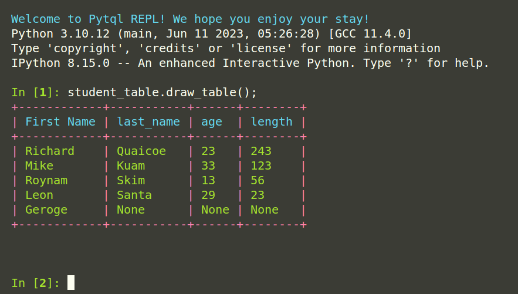

## ReplType
!!! tip ""
    <i style="font-size:18px;">  class  pytql.repl.ReplType
    </i>

 

Class listing of cli repl types.

> default_repl

&nbsp;&nbsp;&nbsp;&nbsp;&nbsp;&nbsp;&nbsp;&nbsp; Default repl to run Pytql client. Non-interactive.

 

> interactive_repl

&nbsp;&nbsp;&nbsp;&nbsp;&nbsp;&nbsp;&nbsp;&nbsp; Interactive repl to run PyTQL client. Interactive but no autocomplete.

 

> ipython_repl

&nbsp;&nbsp;&nbsp;&nbsp;&nbsp;&nbsp;&nbsp;&nbsp; Interactive repl to run Pytql client. Supports autocomplete and autosuggestions.

 

Image of code sample and it's output run from the **ipython_repl** cli client.  

 

!!! tip ""
    <i style="font-size:18px;">  function  pytql.repl.start_client
    (module_name, repl_type: ~pytql.repl.ReplType = <function default_repl>)
    </i>

&nbsp;&nbsp;&nbsp;&nbsp;&nbsp;&nbsp;&nbsp;&nbsp; Function to start the Pytql client repl.   
&nbsp;&nbsp;&nbsp;&nbsp;&nbsp;&nbsp;&nbsp;&nbsp; **Args**:  
&nbsp;&nbsp;&nbsp;&nbsp;&nbsp;&nbsp;&nbsp;&nbsp;&nbsp;&nbsp;&nbsp;&nbsp; module_name : Name of the module PyTQL is being run from. Always pass 
&nbsp;&nbsp;&nbsp;&nbsp;&nbsp;&nbsp;&nbsp;&nbsp;&nbsp;&nbsp;&nbsp;&nbsp;`__name__` as the value.  
&nbsp;&nbsp;&nbsp;&nbsp;&nbsp;&nbsp;&nbsp;&nbsp;&nbsp;&nbsp;&nbsp;&nbsp; repl_type : Repl type to use. Defaults to ReplType.default_repl.

 
